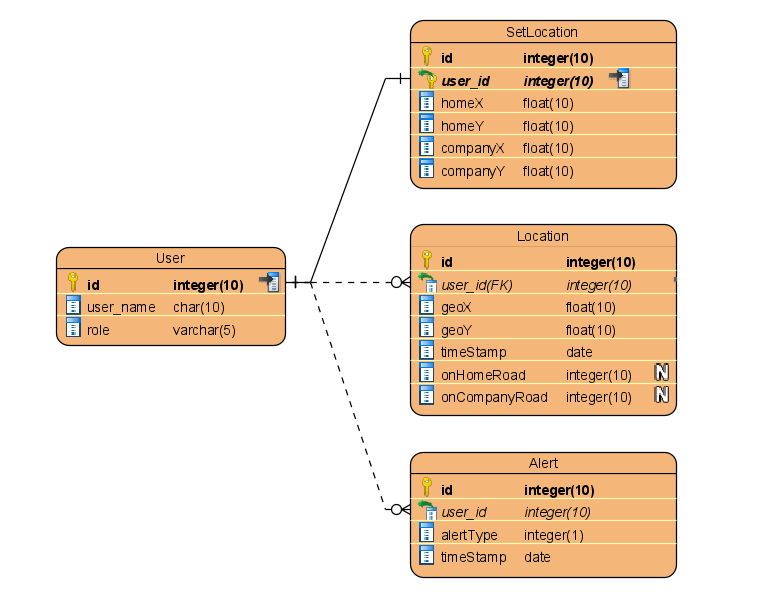
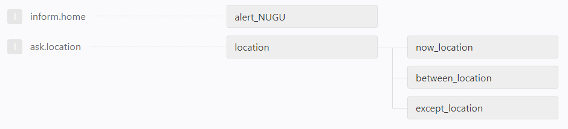

# FAFA : Back-End
<<<<<<< .merge_file_a37240
### REST API : Django / DRF
=======
### REST API : Django & DRF
>>>>>>> .merge_file_a45356

- - -

### :page_facing_up: DataBase : [models.py](https://github.com/HYUcoolguy/FAFA/blob/main/Back-End/FAFA/models.py)

User : 부모 관련 데이터

| 필드      | 타입  | 역할                          | 예시                   |
|:---:       |:---:   |---                          |---                    |
|`id`       |int    |(PK)사용자 고유 id 값         | 1, 2, 3...             |
|`user_name`|char   |Application 로그인 시 필요한 ID| 'mother', 'father' |
|`role`     |varchar|가족 구성원. NUGU play와 Application 연결| '엄마', '아빠'          |

SetLocation : 부모의 회사/집의 위치

    
| 필드      | 타입  | 역할                          | 예시                   |
|:---:        |:---:  |---                          |---                    |
|`id`       |int    |(PK) 고유 id 값        | 1, 2, 3...             |
|`user_id`  |int   |(FK) User 테이블의 id | 1, 2, 3 ... |
|`homeX`     |float|사용자의 집 위도| 36.1234  |
|`homeY`     |float|사용자의 집 경도 | 123.1234      |
|`companyX`     |float|사용자의 회사 위도 | 35.1234    |
|`companyY`   |float|사용자의 회사 경도 | 122.4567     |

Location : 부모의 최근 위치 

    
| 필드      | 타입  | 역할                          | 예시                   |
|:---:        |:---:   |---                          |---                    |
|`id`       |int    |(PK) 고유 id 값        | 1, 2, 3...             |
|`user_id`  |int   |(FK) User 테이블의 id | 1, 2, 3 ... |
|`geoX`     |float|사용자의 현재 위도| 36.1234  |
|`geoY`     |float|사용자의 현재 경도 | 123.1234      |
|`timeStamp`     |date|사용자의 데이터를 저장한 시각 |2020-12-02T...    |
|`onHomeRoad`     |int|퇴근길 표시 (ML 사용)| 0, 1    |
|`onCompanyRoad`   |int|출근길 표시 (ML 사용)| 0, 1     |

Alert : NUGU speaker의 요청 로그

    
| 필드      | 타입  | 역할                          | 예시                   |
|:---:        |:---:   |---                          |---                    |
|`id`       |int    |(PK) 고유 id 값        | 1, 2, 3...             |
|`user_id`  |int   |(FK) User 테이블의 id | 1, 2, 3 ... |
|`alertType`     |int|0 : '아이가 찾고 있어요', 1 : '아이가 집에 도착했어요' | 0, 1  |
|`timeStamp`     |date|자녀의 NUGU 스피커 요청을 저장한 시각 |2020-12-02T...    |

- - -

### :arrow_forward: API : [urls.py](https://github.com/HYUcoolguy/FAFA/blob/main/Back-End/FAFA/urls.py)

#### :baby: NUGU play

| Address          | Method  | 설명|
|---               |:---:  |---                          |
|`health`          |POST   |NUGU play의 연결 상태 확인 | 
|`location`        |POST   |부모 위치 확인 요청 (default)|
|`now_location`    |POST   |집&회사 근처인 경우|
|`between_location`|POST   |집&회사 사이, ML을 활용하여 출퇴근 분류|
|`except_location` |POST   |집&회사 사이가 아닌 경우|
|`alert_NUGU`      |POST   |부모에게 요청 알림|

#### :man: Application

| Address               | Method  | 설명|
|---                    |:---:    |---                          |
|`login`                |POST     |로그인 및 회원 정보 반환|
|`set_location`         |POST     |집&회사의 위도/경도 추가|
|`set_location/<user_id>` |PUT/PATCH|집&회사의 위도/경도 변경|
|`add_location`         |POST     |사용자의 현재 위치,시각,상태 저장|
|`alert`                |GET      |NUGU speaker(자녀)의 요청 로그 확인|

- - -

### :loudspeaker: NUGU play
#### :wrench: General setting
사용자가 '미취학 아동'임을 고려하여 발화 설정 조정
> 발화속도 : 100% -> 90% 
> 문장 사이 묵음 구간 길이 : 600ms -> 800ms

Back-end URL : http://fafa-dev.ap-northeast-2.elasticbeanstalk.com (2020.12.08 기준)

**Play 구조**

#### :man::exclamation: 집에 왔다고 알리기

1. Intent : inform.home

    | 발화 예시         | 엄마  | 나 집이야|
    |:---:               |---  |---|
    |분류  |부모  |집 도착 알림|
    |Entity| `FAMILY_NAME`| STATEMENT_HOME|

2. Back-end server에 Request 요청
    > URL : Back-end/alert_NUGU  
    > METHOD : POST
    ~~~json
    "version": "2.0",
    "action": {
        "actionName": "alert_NUGU",
        "parameters": {
            "FAMILY_NAME":{"type": "FAMILY_NAME", "value": "엄마"}
            }
        }
    ~~~

3. Database에 요청 로그 저장
    ~~~json
    # NUGU family의 Request에서 FAMILY_NAME 값 확인
    nugu_body   = json.loads(request.body, encoding='utf-8')
    FAMILY_NAME = nugu_body.get('action').get('parameters').get('FAMILY_NAME_').get('value')
    user_id     = User.objects.filter(role=FAMILY_NAME).values()[0]["id"]
    
    # Alert 테이블에 데이터 추가
    Alert.objects.create(user_id_id=user_id,alertType=1)
    ~~~

4. Action : alert_NUGU

    | 응답 예시         | 엄마  | 에게 집에 왔다고 알려 드렸어요|
    |:---:               |---  |---|
    |Prompt  |`FAMILY_NAME`  |fix|

#### :baby::question: 부모의 위치 물어보기

1. Intent : ask.location

    | 발화예시 |  엄마  | 지금 어디야|
    |:---:               |---  |---|
    |분류  |부모  |현재 위치 요청|
    |Entity| `FAMILY_NAME`| STATEMENT_LOCATION|

2. Back-end server에 Request 요청
    >URL : proxy server/location  
    >METHOD : POST
    ~~~json
    "version": "2.0",
    "action": {
        "actionName": "location",
        "parameters": {
            "FAMILY_NAME"   : {"type": "FAMILY_NAME", "value": "엄마"}, 
            "LOCATION"      : {"type": null, "value": null},
            "STATUS"        : {"type": null, "value": null},
            "START_LOCATION": {"type": null, "value": null},
            "DESTI_LOCATION": {"type": null, "value": null}
            }        
        }
    ~~~

3. 부모의 위치에 따라 다른 Action 반환

   3.1 set_location : 최근 위치가 회사 | 집
    ~~~json
    "output": {
        "FAMILY_NAME" : "엄마",
        "LOCATION"    : "집"
    }
    ~~~

    | 응답예시 | 엄마|는 |회사 |에 있어요|
    |:---:        |--- |---| ---| ---|
    |Prompt  |`FAMILY_NAME`  |fix|`LOCATION` | fix|

    3.2 between_location : 최근 위치가 회사-집 사이
    > 출근/퇴근은 ML의 randomForest 활용하여 분류

    ~~~json
    "output" :{ 
        "FAMILY_NAME"    : "엄마",
        "START_LOCATION" : "회사",
        "DESTI_LOCATION" : "집",
        "STATUS"         : "퇴근하는"
        }
    ~~~
    | 응답예시 | 엄마      |는 |회사 |에서 | 집|으로 |퇴근하는| 중이에요|
    |:---:        |---        |---| ---| ---| ---| ---| ---|---|
    |Prompt  |`FAMILY_NAME` |fix|`START_LOCATION`|fix|`DESTI_LOCATION`|fix|`STATUS`|fix|

    3.3 except_location : 최근 위치가 회사-집 사이가 아닌 경우
    ~~~json
    "output": {
        "FAMILY_NAME": "엄마"
    }
    ~~~
    | 응답예시         | 엄마  | 는 외출 중이에요|
    |:---:               |---  |---|
    |Prompt  |`FAMILY_NAME`  |fix|
