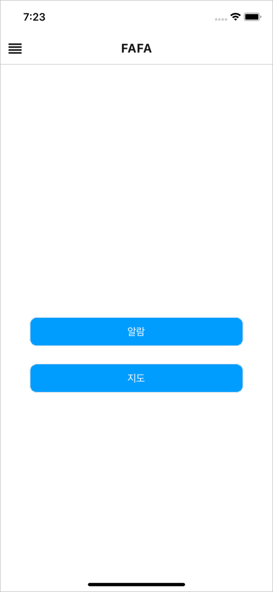
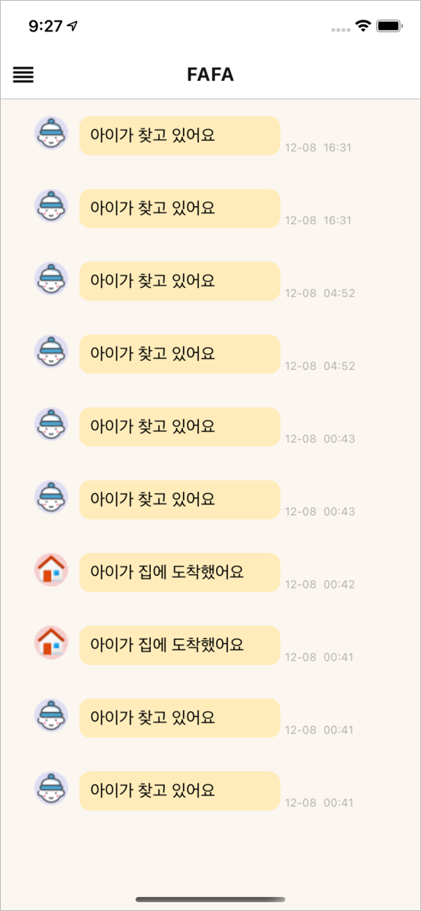
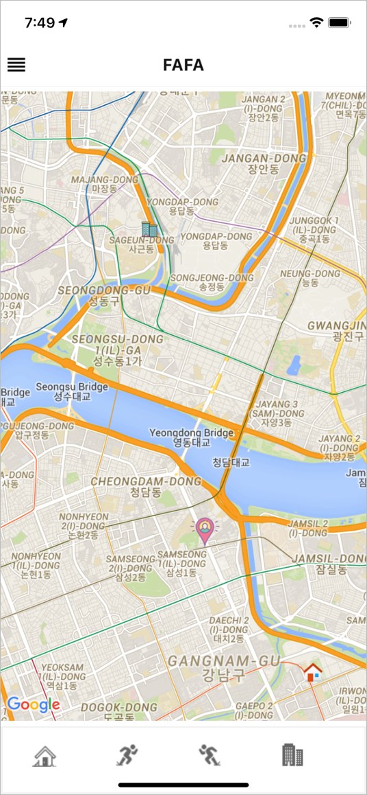
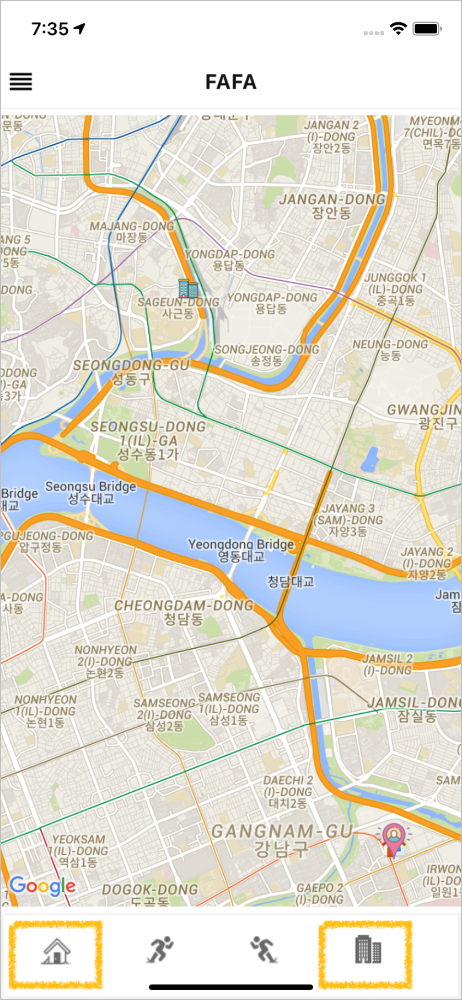
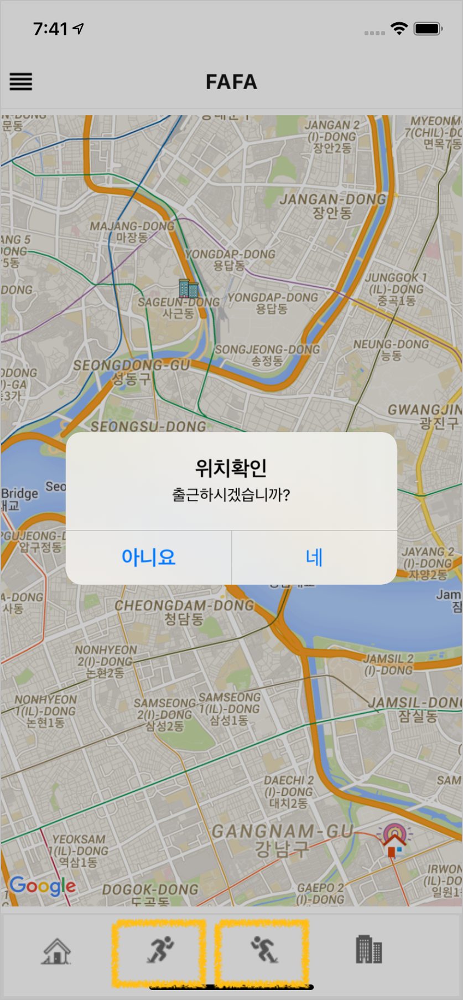
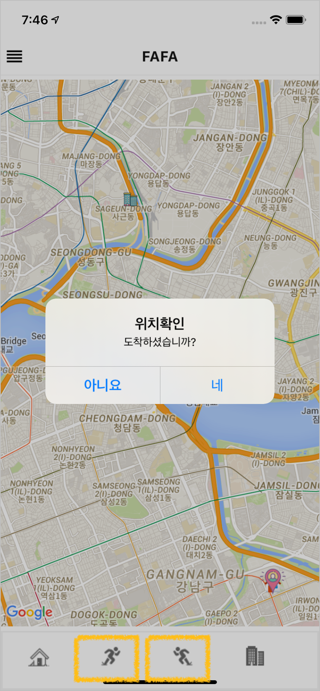

# FAFA : Front-End
### Mobile Application : React Native

<div>
 
 
 
</div>

- - - 

### 설치
```bash
$ npm install
$ react-native run-ios
```

### Application 설명

1. 로그인

지정된 '아이디'와 '비밀번호'를 입력하여 로그인합니다.


2. 랜딩 페이지

로그인 후, '알림'페이지와 '지도' 페이지를 선택하는 기능을 제공합니다.


3. 알림 페이지

NUGU 스피커를 사용한 자녀의 요청을 확인합니다.
부모님을 찾을 때는 '아이가 찾고 있어요' 알림이,
집에 도착했다는 소식을 부모님께 알릴 때는 '아이가 집에 도착했어요' 알림이 표시됩니다.



4. 지도 페이지 (집/회사 )

Google Map 위에 표시된 마커는 사용자의 현재 위치를 나타냅니다. 100m 이동 시, 자동으로 서버에 현재 위치를 전송합니다.

하단의 집/회사 아이콘을 클릭하면 현재 사용자의 위치를 집과 회사로 저장합니다.



4. 지도 페이지 (출퇴근 버튼)
하단의 버튼을 출퇴근 전후에 클릭하세요!
해당 기능을 통해 출퇴근 경로, 시간을 머신러닝 기법으로 분석합니다. 추후에는 해당 버튼을 클릭하지 않아도 자동으로 출퇴근 정보를 인식하여 자녀에게 부모의 위치 정보를 알려줍니다.