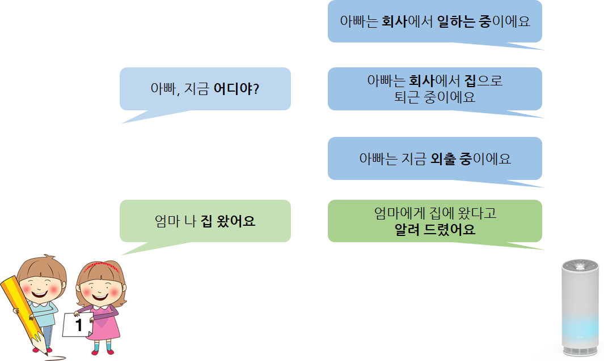
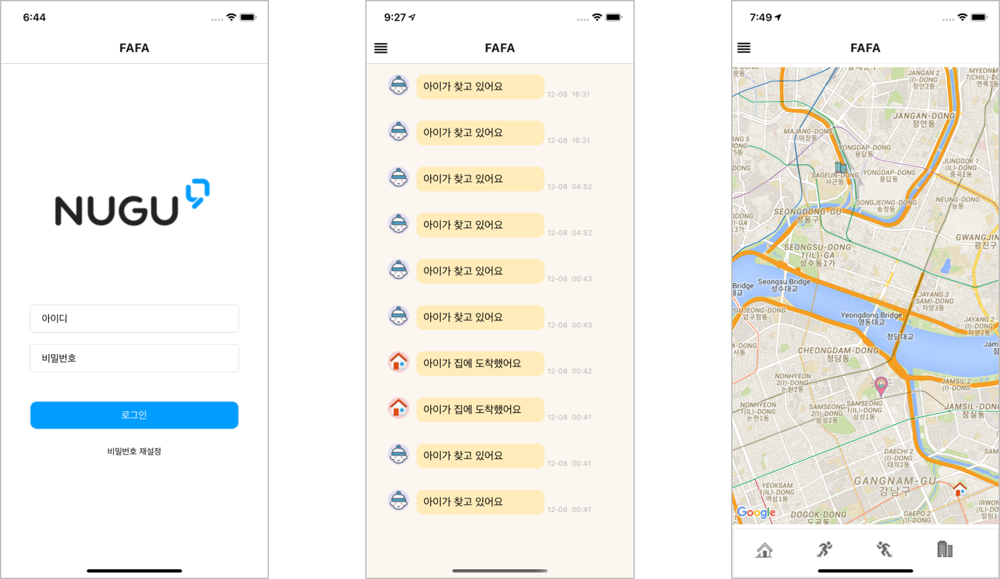

# FAFA
### :baby::man: AI 스피커 & 머신러닝 활용한 부모/자녀 양방향 LBS

 
 
 

 

[Front-End](https://github.com/HYUcoolguy/FAFA/blob/main/Front-End/README.md) 문서에서 애플리케이션의 설명 및 실행 방법과 
[Back-End](https://github.com/HYUcoolguy/FAFA/blob/main/Back-End/README.md) 문서에서 NUGU play 및 전체 구조를 확인하세요.

[Tech Blog](https://www.notion.so/Connect-to-Parents-FAFA-06fe4beac6ba45a0800b35bb5d1fdb3b)에서 Machine Learning 관련 상세 내용을 확인할 수 있습니다.
- - -

### :eyes: 개요 
 FAFA는 아이와 부모의 양방향 소통을 위한 인공지능 스피커 기반 서비스이다. 초등학교 고학년 이상의 휴대폰 보급률은 점점 증가하고 있지만, 가정 내 유선전화 보급률과 미취학 아동의 휴대폰 보급률은 반대로 줄어드는 추세이다. 즉, 미취학 아동의 통신 수단 고립이 심화하였다.
 
 이를 해결하고자 휴대폰이 아닌 인공지능 스피커를 활용해 부모와 아이의 양방향 소통을 제공한다. 아이는 NUGU(SKT의 인공지능 스피커)를 통해, 부모는 모바일 애플리케이션을 통해 서로 소통한다.
 
- - - 

### :grey_question::grey_exclamation: 서비스 소개
#### :chart_with_downwards_trend: 문제 파악
2018년 기준 초등학교 고학년의 휴대폰 보급률은 90% 이상이지만, 저학년의 보급률은 58.8%이고 유치원생까지 포함한다면 그 격차는 더 클 것으로 예상한다. 또한 유선 전화 보급률은 매년 줄어드는 추세이며 2019년에는 최저치인 51.9%를 기록했다. 이를 통해 휴대폰 없이 **집에 혼자 남은 아이가 부모에게 연락할 수단이 없는 상황**이 증가하는 추세임을 파악했다.

#### :mag_right: 문제 분석 
자녀의 스마트폰을 개통하는 방법도 있지만, 부모들은 **비용에 대한 부담**과 어린 자녀의 **게임 중독 우려**로 구매를 망설인다. 또한 부모가 자녀의 위치를 확인하는 LBS 서비스는 시중에 많지만, **그 반대로 집에 혼자 남은 아이가 부모의 현재 정보를 파악할 방법은 없는 상태**이다.

#### :bulb: 해결 방안
SKT의 인공지능 스피커 **NUGU를 활용하여** 휴대폰이 없는 자녀를 위한 부모와의 연결 서비스를 개발한다. 집에 혼자 남은 아이는 스피커에 부모의 위치를 물어보고, 부모는 아이가 집에 도착했는지/자신을 찾았는지 애플리케이션으로 확인할 수 있기에 부모와 아이의 **양방향 소통**이 가능해질 것이다. 부모의 출퇴근 여부를 파악하기 위해 **머신러닝의 Random Forest**를 활용하여, 위치 정보를 기반으로 더 정확하게 부모의 위치를 파악할 수 있다.

자녀의 스마트폰 구매 부담 없이 NUGU 스피커를 활용하면 되기에 부모 입장에서는 **아이의 휴대폰 중독 및 휴대폰 비용에 대한 부담이 없다.** 또한 **기존 LBS 서비스들은** '부모 > 자녀'의 단방향 소통을 제공했지만 FAFA는 '자녀 <> 부모'의 양방향 소통을 제공하기에 **차별점**을 가진다.

- - -

### :clipboard: 서비스 구조

NUGU speaker

 
 > 자녀의 발화 분석 (Intent & Entity)
 
 > Back-end server에 위치 정보 요청
 
 > Back-end server에 로그 생성 요청
  
 > 부모 위치 정보 응답
 
 > 요청 정상 전달 응답

Back-end proxy server

 
 > 부모의 최근 위치를 기반으로 상태 분석 (ML - randomForest 사용)

 > Application에 NUGU speaker의 요청 로그 전달
 
 > NUGU speaker에 부모의 상태와 위치 정보 전달

Application

 
 > 회사와 집의 위도와 경도 설정
 
 > NUGU speaker로 자신을 찾은 아이의 요청 확인
 
 > Back-end server에 최근 위치 전송

- - -

### :family: UI
#### :baby: VUI (Voice User Interface)

NUGU speaker를 사용하는 자녀

#### :man: GUI (Graphical User Interface)

Application을 사용하는 부모

자세한 화면 설명은 [여기](https://github.com/HYUcoolguy/FAFA/blob/main/Front-End/README.md)서 확인하세요!

*최근 위치 정보는 100m 이동 시마다 자동으로 서버에 전송*

---

### :tv: Video

[Demo](https://youtu.be/iiE26_AL2y0) 

[Presentation](https://youtu.be/ittHCHFu2MM)

해당 문서는 [document/Presentation.pdf](https://github.com/HYUcoolguy/FAFA/document/Presentation.pdf)에서 확인 가능합니다.

- - -

### :fire: Contributors

[박형진](https://github.com/HYUcoolguy)  : Back-end 개발 및 서버 배포 (Django / AWS)

[이준석](https://github.com/junslee0912) : ML 기법 활용 및 데이터셋 수집

[이정선](https://github.com/sseonnn) : NUGU 개발 및 배포 

[윤승권](https://github.com/sgwon96) : Front-end 개발 (React Native)

